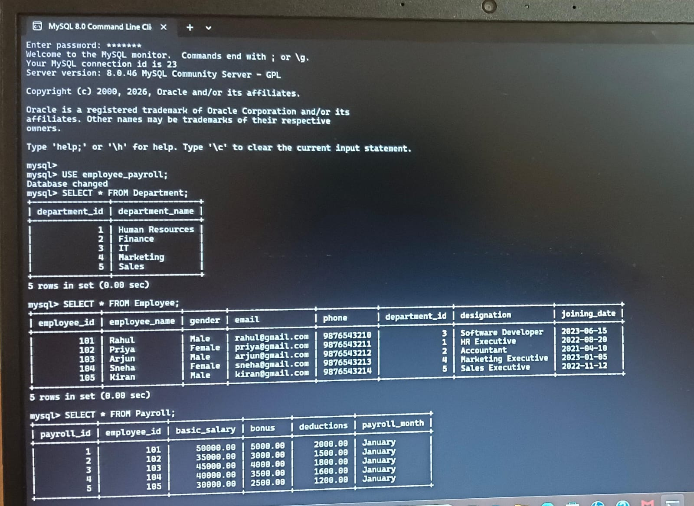
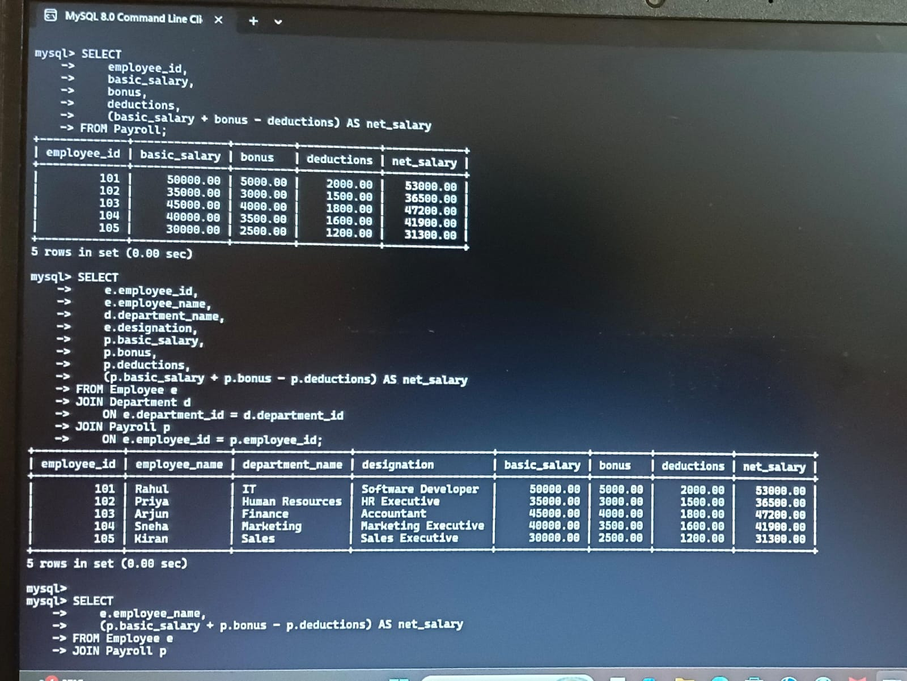
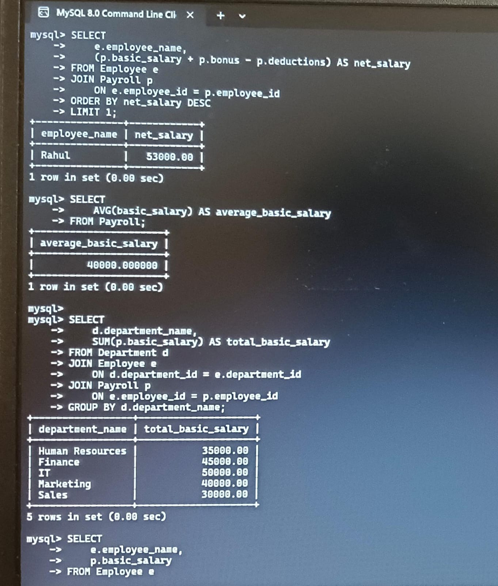
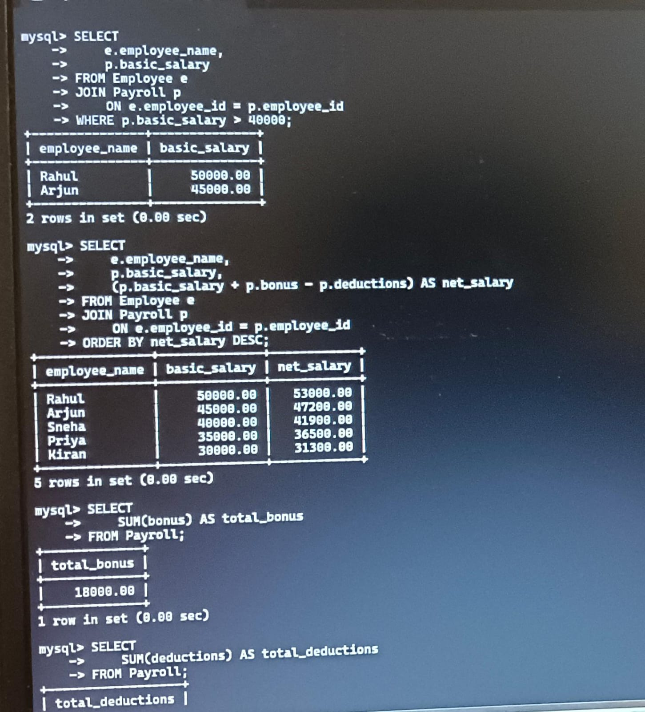
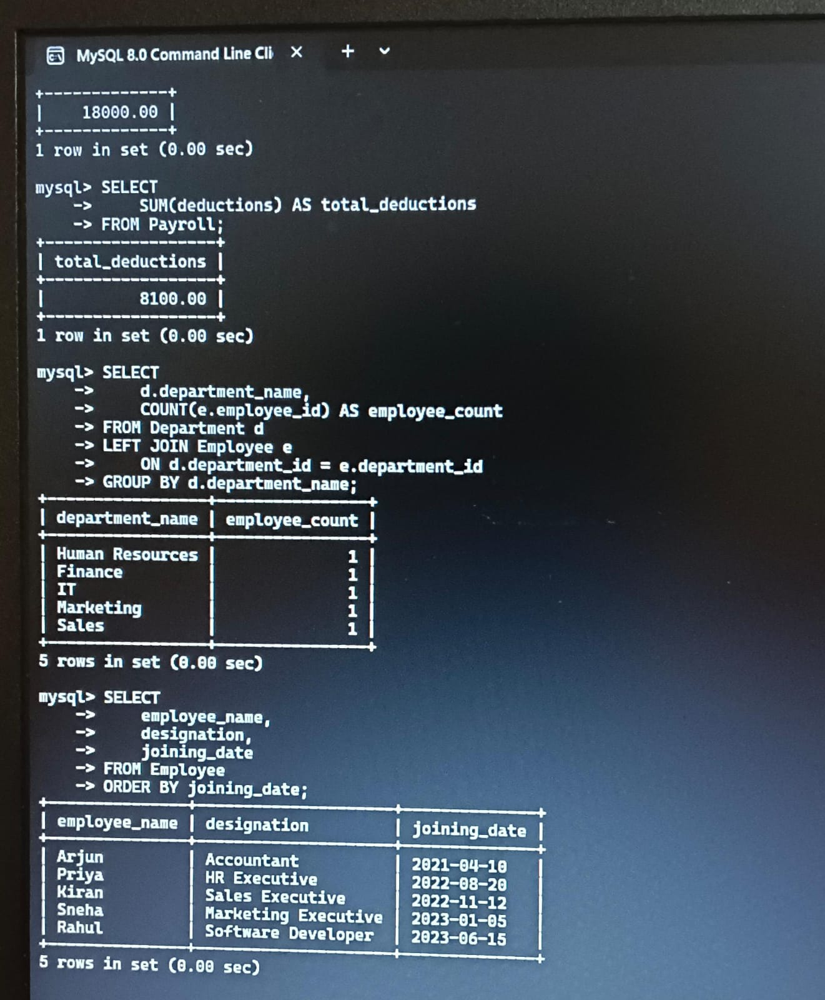

# Employee-payroll-database

Employee Payroll Database is a MySQL project that manages employee details, salaries, bonuses, and deductions, with SQL queries for payroll analysis.

## Internship Details

- INTERN ID- CITS8931
- INTERN NAME - Meghana d m
- NO OF WEEKS - 4
- PROJECT NAME - LIBRARY MANAGEMENT DATABASE

## Project Description

Employee Payroll Database is a MySQL project that manages employee details, salaries, bonuses, and deductions, with SQL queries for payroll analysis.

## Project Scope

The Employee Payroll Database is designed to store and manage employee, department, and payroll information efficiently.

The system maintains employee details, department information, salary, bonuses, and deductions. SQL queries are used to calculate net salary and generate useful payroll reports.

## Objectives

- Manage employee information.
- Store department details.
- Manage employee payroll records.
- Calculate net salary.
- Calculate bonuses and deductions.
- Analyze salary information using SQL queries.
- Generate payroll reports.
- Demonstrate primary and foreign key relationships.

## Technologies Used

- MySQL
- SQL
- MySQL Workbench

## Database Structure

The project contains three main tables:

### 1. Department

Stores department information.

| Column | Data Type | Description |
|---|---|---|
| department_id | INT | Primary key |
| department_name | VARCHAR(50) | Name of department |

### 2. Employee

Stores employee information.

| Column | Data Type | Description |
|---|---|---|
| employee_id | INT | Primary key |
| employee_name | VARCHAR(100) | Employee name |
| gender | VARCHAR(10) | Employee gender |
| email | VARCHAR(100) | Employee email |
| phone | VARCHAR(15) | Employee phone |
| department_id | INT | Foreign key |
| designation | VARCHAR(50) | Employee designation |
| joining_date | DATE | Date of joining |

### 3. Payroll

Stores salary and payroll information.

| Column | Data Type | Description |
|---|---|---|
| payroll_id | INT | Primary key |
| employee_id | INT | Foreign key |
| basic_salary | DECIMAL(10,2) | Basic salary |
| bonus | DECIMAL(10,2) | Employee bonus |
| deductions | DECIMAL(10,2) | Salary deductions |
| payroll_month | VARCHAR(20) | Payroll month |

---

## Relationships

- One department can have multiple employees.
- Each employee belongs to one department.
- Each employee has a payroll record.
- `department_id` connects the Employee table with the Department table.
- `employee_id` connects the Payroll table with the Employee table.

## Key SQL Operations

The project demonstrates:

- CREATE DATABASE
- CREATE TABLE
- INSERT
- SELECT
- WHERE
- JOIN
- GROUP BY
- ORDER BY
- COUNT()
- SUM()
- AVG()
- LIMIT
- Aggregate Functions
- Primary Keys
- Foreign Keys

## Salary Calculation

The net salary is calculated using:

**Net Salary = Basic Salary + Bonus - Deductions**

Example:

Basic Salary = ₹50,000  
Bonus = ₹5,000  
Deductions = ₹2,000

Net Salary = ₹53,000

## Features

The database can:

1. Display all departments.
2. Display all employees.
3. Display payroll records.
4. Calculate net salary.
5. Find the highest-paid employee.
6. Calculate average basic salary.
7. Calculate total bonus.
8. Calculate total deductions.
9. Display department-wise salary.
10. Find employees earning more than ₹40,000.
11. Sort employees according to salary.
12. Count employees in each department.

---
## 📸 Output Screenshots

### Output 1

### Output 2

### Output 3

### Output 4

### Output 5

